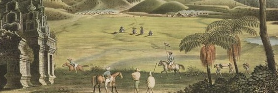

# Telusur Hindia

  

## Tentang Proyek Ini

Proyek inisiatfi berbentuk komunitas terbuka-terbatas yang bersifat kerja kolektif. Tujuan proyek ini adalah melakukan georeferensi/georektifikasi serta digitasi objek kuno berdasarkan sumber dokumen yang dipandang sebagai pontesi objek diduga cagar budaya.

Proyek ini dilakukan secara sukarela dan bersifat non-komersil.

## Prinsip Utama

Kami berpegang pada beberapa prinsip utama:

1. **Keterbukaan:** Seluruh data hasil digitasi bersifat terbuka. Proses kerja dan diskusi dilakukan secara transparan.
2. **Kolaborasi:** Proyek ini hidup dari kontribusi banyak orang. Kami mendorong kerja sama dan saling membantu.
3. **Non-Komersial:** Kami hanya menggunakan peta sumber yang bebas dari batasan hak cipta komersial dan ditujukan untuk kepentingan publik.
4. **Akurasi dan Kualitas:** Kami berupaya untuk menghasilkan data geospasial yang seakurat mungkin sesuai dengan peta sumbernya.
5. **Penghargaan pada Sumber:** Setiap data yang dihasilkan wajib menyertakan sumber data yang jelas mengenai sumber peta aslinya.

## Cara Menjadi Kontributor

Setiap orang/kelompok dipersilakan untuk berkontribusi\! Berikut adalah langkah-langkah dan aturan umum untuk menjadi kontributor:

### 1\. Sumber Peta

Sebelum memulai, pastikan peta yang akan Anda digitasi memenuhi kriteria berikut:

  ***Berasal dari Sumber Terbuka:** Peta harus berasal dari arsip publik, perpustakaan universitas, museum, atau repositori online yang secara eksplisit menyatakan kontennya bebas digunakan ulang dengan Contoh KITLV

  ***Non-Komersial & Bebas Hak Cipta:** Pastikan tidak ada batasan hak cipta yang melarang proses digitasi dan distribusi ulang. **Kontributor bertanggung jawab penuh untuk memverifikasi status lisensi peta sumber.** Jika ragu, jangan gunakan peta tersebut.

  ***Memiliki Resolusi Cukup:** Peta harus memiliki resolusi yang memadai agar detail seperti teks, jalan, dan batas wilayah dapat terlihat jelas untuk proses digitasi.

### 2\. Proses Georeferensi dan Digitasi

Proses kontribusi secara umum terdiri dari:

1. **Georeferencing:** Menyelaraskan citra peta kuno dengan sistem koordinat geografis modern (misalnya, menggunakan QGIS, ArcGIS, atau platform online).
2. **Ekstraksi Fitur (Digitasi):** Menggambar ulang fitur-fitur penting dari peta kuno menjadi data vektor (titik, garis, poligon). Contoh fitur yang bisa diekstraksi:

   * Jalan lama dan jalur kereta api
   * Batas administratif (desa, distrik, provinsi)
   * Nama-nama tempat (toponimi)
   * Sungai dan garis pantai
   * atau objek lainnya.

### 3\. Standar Teknis

Untuk menjaga konsistensi dan kualitas data, harap ikuti standar berikut:

  ***Format Data:**

    * Data vektor (hasil ekstraksi fitur) harus dalam format**GeoJSON (`.geojson`)**.
    
    * Sistem Proyeksi Koordinat (CRS):** Semua data harus menggunakan **WGS 84 (EPSG:4326)**.

    * Standar_Penamaan_File mengikuti jenis kategorinya, Contoh: Makam_Kuno, Jalan_Kuno**.
    
  ***Data Atribut:**
    
    * Feature ID ditulis dengan fid, tipe data int64
    * Tahun Peta ditulis dengan THN_PT, tipe data int32
    * Jenis Peta ditulis dengan JNS_PT, tipe data string
    * Root Mean Square Error ditulis dengan RMSE, tipe data decimal
    * Resident atau Residence ditulis dengan RSDNT, tipe data string
    * squareMeter atau akurasi ditulis dengan sqM/Akurasi, tipe data decimal
    * Afdeeling ditulis dengan AFDL, tipe data string
    * Jenis Object ditulis dengan JENISOB, tipe data string

  **Standar penamaan file mengikuti jenis kategorinya, seperti contoh: Makam_Kuno, Jalan_Kuno, Bangunan_Kuno**
    
  

### 4\. Alur Kerja Pengiriman Kontribusi (via GitHub)

1. **Fork** repositori ini.
2. Buat **Branch** baru untuk pekerjaan Anda, contoh (`git checkout -b fitur/digitasi-peta-batavia-1885`).
3. Tambahkan file hasil digitasi Anda ke dalam folder yang sesuai.
4. **Commit** perubahan Anda dengan pesan yang jelas.
5. **Push** ke branch Anda di fork Anda.
6. Buka **Pull Request (PR)** ke branch `main` repositori ini.
7. Pada deskripsi Pull Request, jelaskan secara singkat peta apa yang Anda digitasi, sumbernya, dan fitur apa saja yang diekstraksi. Kontributor lain akan meninjau kontribusi Anda.

## Aturan Perilaku Komunitas

Kami ingin komunitas ini menjadi tempat yang aman dan ramah bagi semua orang.

  ***Bersikap Hormat dan Sopan:** Perlakukan semua orang dengan hormat. Kritik yang membangun dipersilakan, tetapi serangan pribadi tidak akan ditoleransi.

  ***Kolaboratif:** Proyek ini adalah upaya bersama. Terbukalah untuk menerima masukan dan bekerja sama dengan kontributor lain.

  ***Fokus pada Kualitas:** Berikan yang terbaik dalam setiap kontribusi. Jika menemukan kesalahan pada data yang sudah ada, silakan buka *Issue* untuk mendiskusikannya.

  ***Nol Toleransi untuk Pelecehan:** Pelecehan dalam bentuk apa pun tidak akan ditoleransi.

## 💬 Hubungi Kami & Diskusi

Punya pertanyaan, ide, atau butuh bantuan?

* Untuk diskusi terkait data atau masalah teknis, silakan buka **"Issue"** di repositori GitHub ini.

Terima kasih atas minat dan kontribusi Anda dalam melestarikan sejarah untuk generasi mendatang\!
